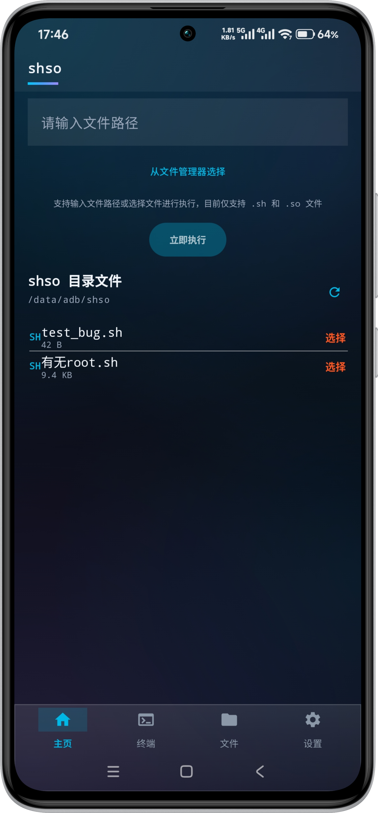
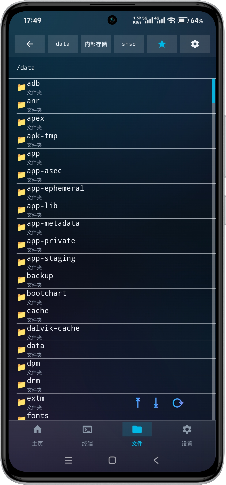
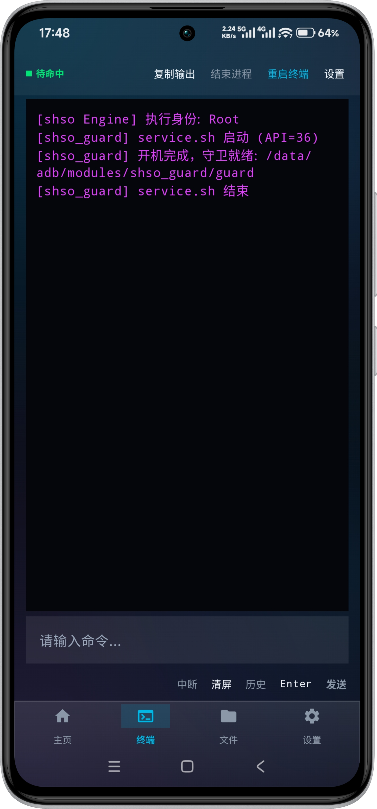
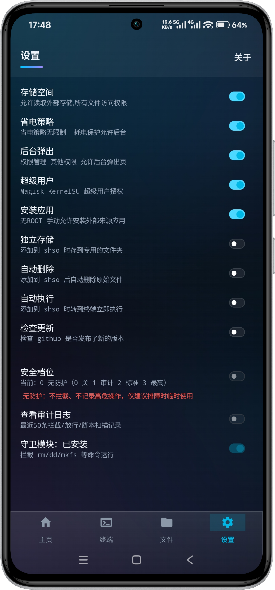
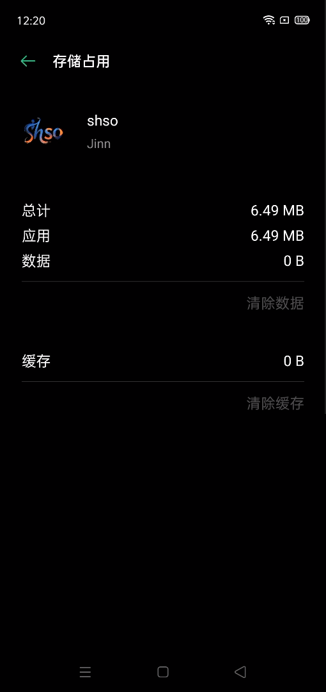
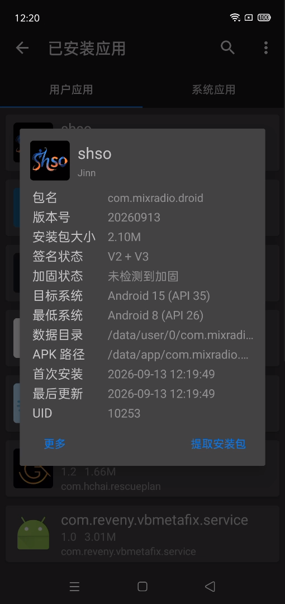
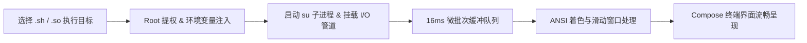

<div align="center">

# shso

**Android ROOT 环境下的图形化脚本 / 原生程序执行工具**

[](https://github.com/yezijinn/shso/releases)
[](LICENSE)
[](https://developer.android.com)
[](https://github.com/topjohnwu/Magisk)

[下载最新版本 (Releases)](https://github.com/yezijinn/shso/releases)

</div>

---

## 📖 项目简介

**shso** 是一款运行在 Android ROOT 环境下的图形化辅助执行工具（包名 `com.qihoo360.mobilesafe`，版本 9.0.2/283）。

在日常玩机、系统调优或模块调试过程中，经常需要运行一些 Shell 脚本（`.sh`）或原生可执行程序（`.so` / ELF 二进制）。以往通常需要借助完整的终端模拟器（如 Termux）或通过电脑连接 ADB 敲命令行。

shso 简化了这一操作流程：提供现代化的图形交互界面，无需面对复杂的命令行语法即可一键执行脚本、实时查看带 ANSI 颜色高亮的控制台日志、进行标准输入交互，并直接在手机上进行全盘 ROOT 级别的文件管理。界面为等宽字体 + 直角矩形玻璃暗色风格，冷启动直接进入主页，无多余加载流程。

---

## 📸 应用截图

| 主页 | 文件管理 |
| :---: | :---: |
|  |  |

| 终端 | 设置 |
| :---: | :---: |
|  |  |

| 存储占用 | 安装包 |
| :---: | :---: |
|  |  |

---

## 🌟 核心功能

### 1. 🚀 一键 ROOT 脚本与二进制执行
* **支持格式**：原生支持 `.sh` 脚本及 `.so` 原生二进制文件（ELF 可执行程序），其余格式明确拒绝。
* **自动化环境注入**：执行时自动注入标准 Linux 环境变量（`PATH`、`TERM=xterm-256color`、`LANG`）并自动补齐执行权限（`chmod 777`）。
* **生命周期与信号流控**：实时捕获任务运行状态与退出码，支持标准输入（`stdin`）指令发送、`Ctrl+C`（`SIGINT`）中断与强制结束进程（`kill -9`）。
* **无 ROOT 也可浏览界面**：终端页面不再拦截打开；是否具备 ROOT 仅影响底部 DockBar「终端」tab 字样颜色（红色提示）。

### 2. 📁 文件管理与「添加到 shso」
* **默认工作区**：内置快捷直达 `/data/adb/shso` 工作区（历史遗留的 `/data/adb/KernelEX` 目录不迁移、不删除）。
* **全盘文件访问**：支持浏览系统根目录（`/`）、内部存储及受保护的 `/data` 分区。
* **实用管理功能**：文件列表支持名称/时间升降序排序、隐藏文件开关、列表字体大小调节（5–30sp，默认 15sp）、刷新、删除、重命名；点击 `.ttf` / `.otf` 字体文件可预览并一键应用为全局软件字体。
* **添加到 shso**：长按任意文件可「添加到shso」，并可按设置自动完成：复制到独立文件夹存储、清理源文件、跳转终端自动执行。

### 3. 💻 极简终端
* **ANSI 文本着色**：内置 ANSI 转义序列解析器，支持标准 16 色与加粗文本渲染，文字颜色可在终端设置中自定义。
* **紧凑操作区**：顶部一排按钮（复制输出 / 结束进程 / 重启终端 / 设置），IDLE/RUNNING 状态灯于最左；底部「请输入命令…」输入行配合 中断 / 清屏 / Enter / 发送 动作按钮。
* **终端设置随页而至**：终端文字颜色、HyperCore 终端提示、shso 终端提示三个设置收进终端页右上「设置」按钮的弹窗。

### 4. ⚙️ 扁平设置页
* 权限区与行为区全部置于同一列表，无分组标题、无分割线：存储空间、省电策略、后台弹出、超级用户（权限状态实时显示，点击跳转对应系统授权页），随后是独立存储、自动删除、自动执行三个行为开关。
* 关于入口移至右上角按钮（弹窗展示图标 / 版本 / Github 链接）。

### 5. 🎨 直角矩形玻璃风格
* 100% AndroidX Compose Material 3 原生控件，深色「极光玻璃」主题；全工程强制直角矩形（`RoundedCornerShape(0.dp)`），移除所有外层 Card/Container 容器，行间以细分割线或直接零间距排版。

### 6. 🔷 自适应桌面图标
* 采用 Android **Adaptive Icon**，自动适配各厂商桌面形状（圆形 / 圆角矩形 / 水滴等），无需为不同形状单独出图。
* 背景透明、前景为去白去黑后的彩色艺术字（缩进中心安全区），任意 OEM mask 下均完整显示，不裁切。

---

## 🛠️ 执行流程简述



---

## 📱 运行环境要求

| 项目 | 要求 |
| :--- | :--- |
| **系统版本** | Android 8.0 (API 26) 及以上 |
| **设备架构** | `arm64-v8a`、`armeabi-v7a`、`x86_64` |
| **ROOT 方案** | 已安装并授权 **Magisk**、**KernelSU** 或 **APatch**（浏览与执行 ROOT 文件所需） |
| **存储权限** | 需要授予「所有文件访问权限」（用于管理外部存储脚本） |

---

## 🚀 快速上手

1. **安装并授权**：安装 shso 后打开，授予「所有文件访问权限」与 ROOT 超级用户权限（ROOT 授权在设置页可随时查看与补授权）；
2. **选择目标**：
   * **方式 A**：在「主页」直接输入文件绝对路径，或点击「从文件管理器选择」；
   * **方式 B**：在「文件」页面找到目标脚本/程序，长按选择「添加到 shso」；
   * **方式 C**：将脚本直接放置于 `/data/adb/shso/` 目录下；
3. **开始执行**：点击「立即执行」，界面自动切换至「终端」页面展示实时运行日志；
4. **控制与交互**：运行过程中可通过底部输入栏向进程发送输入参数，或使用「中断」/「结束进程」控制任务。

---

## 🏗️ 源码构建

本项目为**自包含工程**：仅 `include(":app")`，无任何仓库外源码/模块依赖，clone 后可直接独立构建。

```bash
# 1. 克隆本仓库
git clone https://github.com/yezijinn/shso.git
cd shso

# 2. 编译 Debug 调试包
./gradlew :app:assembleDebug

# 3. 编译 Release 正式包
./gradlew :app:assembleRelease
```

> Windows 下可运行仓库内一键脚本 `python build_apk.py --skip-check`（内含 V2+V3 签名与产物校验）。

编译输出的 APK 位于 `app/build/outputs/apk/` 目录下（Release 产物默认签名为 V2+V3，签名文件 `release.jks` 不在仓库内）。

---

## 🛡️ 安全与防护说明

* **防 Shell 命令注入**：所有通过 `su -c` 调用的路径均采用标准单引号转义处理（`replace("'", "'\\''")`）；
* **防路径穿越**：文件管理与重命名严格过滤 `..`、`\`、`\0` 等异常路径字符；
* **授权超时熔断**：ROOT 鉴权检测加入协程超时限制，避免因授权管理器卡死导致应用未响应；
* **安全数据保护**：关闭 `allowBackup`，防止通过 ADB 备份机制提取私有数据。

---

## 📄 开源许可证

本项目基于 [Apache License 2.0](LICENSE) 协议开源。

---

<div align="center">
  <sub>shso contributors · 2026</sub>
</div>
