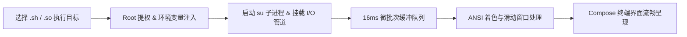

<div align="center">

# ⚡ KernelEX

**下一代 Android 高性能 ROOT 任务调度与执行引擎**
=======
**专为 Android ROOT 环境打造的可视化脚本与原生程序执行工具**

[](https://github.com/KernelExtend/KernelEX/releases)
[](LICENSE)
[](https://developer.android.com)
[](https://github.com/topjohnwu/Magisk)
[](https://t.me/KernelEX)

[下载最新版本 (Releases)](https://github.com/KernelExtend/KernelEX/releases) • [Telegram 讨论频道](https://t.me/KernelEX) • [官方网站](https://kernelextend.github.io/)

</div>

---

## 📖 项目简介

**KernelEX** 是一款运行在 Android ROOT 环境下的图形化辅助执行工具。

在日常玩机、系统调优或模块调试过程中，我们经常需要运行一些 Shell 脚本（`.sh`）或原生可执行程序（`.so` / ELF 二进制）。以往通常需要借助完整的终端模拟器（如 Termux）或通过电脑连接 ADB 敲命令行。

KernelEX 简化了这一操作流程：它提供了一个现代化的图形交互界面，让你无需面对复杂的命令行语法，即可一键执行脚本、实时查看带有 ANSI 颜色高亮的控制台日志、进行标准输入交互，并直接在手机上进行全盘 ROOT 级别的文件管理。

---

## 🌟 核心功能

### 1. 🚀 一键 ROOT 脚本与二进制执行
* **支持格式**：原生支持 `.sh` 脚本及 `.so` 原生二进制文件（ELF 可执行程序）。
* **自动化环境注入**：执行时自动注入标准 Linux 环境变量（`/sbin`、`/system/bin`、`PATH`、`TERM=xterm-256color`、`LANG=en_US.UTF-8`）并自动补齐执行权限（`chmod 777`）。
* **生命周期与信号流控**：实时捕获任务运行状态与退出码，支持标准输入（`stdin`）指令发送、`Ctrl+C`（`SIGINT`）中断与强制结束进程（`kill -9`）。

### 2. ⚡ 平滑日志流控与内存保护
* **16ms 批处理防抖**：面对海量日志高频刷屏场景，采用并发微批次队列聚合调度，避免因高频触发 Compose UI 重组而导致界面掉帧或卡顿。
* **滑动窗口内存保护**：当控制台输出超过预设上限（250,000 字符）时，自动执行智能滑动截断，防止长时间运行大输出任务导致内存溢出（OOM）。
* **ANSI 文本着色**：内置 ANSI 转义序列解析器，支持标准 16 色与加粗文本渲染。

### 3. 📁 ROOT 全盘文件管理
* **默认工作区**：内置快捷直达 `/data/adb/KernelEX` 默认工作区。
* **全盘文件访问**：支持浏览系统根目录（`/`）、内部存储以及受保护的 `/data` 分区。
* **实用管理功能**：支持一键添加到 KernelEX、独立文件夹隔离存放、添加后自动执行、源文件自动清理、重命名与删除。
* **字体文件预览**：支持在文件管理器中直接点击 `.ttf` / `.otf` 字体文件进行实时文本预览，并支持一键应用为全局软件字体。

### 4. 🎨 MIUIX 质感设计与高度个性化
* **双主题风格**：原生支持 **MIUIX (HyperOS 质感风格)** 与 **Material 3** 风格自由切换。
* **深色模式适配**：支持跟随系统、强制浅色或强制深色模式。
* **多样化 Dock 栏**：支持标准贴底栏、悬浮胶囊 Dock 栏与 Spring 弹簧动效。
* **自定义调色盘**：内置 16 种极客预设配色，并提供全色相（Hue）与明暗度调节滑块，支持自定义终端文字高亮颜色。

---

## 🛠️ 执行流程简述



---

## 📱 运行环境要求

| 项目 | 要求 |
| :--- | :--- |
| **系统版本** | Android 8.0 (API 26) 及以上 |
| **设备架构** | `arm64-v8a`、`armeabi-v7a`、`x86_64` |
| **ROOT 方案** | 已安装并授权 **Magisk**、**KernelSU** 或 **APatch** |
| **存储权限** | 需要授予「所有文件访问权限」（用于管理外部存储脚本） |

---

## 🚀 快速上手

1. **安装并授权**：安装 KernelEX 并打开，根据引导界面授予 **ROOT 超级用户权限** 及 **全盘文件访问权限**；
2. **选择目标**：
   * **方式 A**：在「主页」直接输入文件绝对路径，或点击「从文件管理器选择」；
   * **方式 B**：在「文件」页面找到目标脚本/程序，长按选择「添加到 KernelEX」；
   * **方式 C**：将脚本直接放置于 `/data/adb/KernelEX/` 目录下；
3. **开始执行**：点击「立即执行」，界面将自动切换至「终端」页面展示实时运行日志；
4. **控制与交互**：运行过程中可通过底部输入栏向进程发送输入参数，或使用「中断」/「结束进程」控制任务。

---

## 🏗️ 源码构建

本项目采用 Gradle 与 Kotlin 进行构建。

### 编译步骤

```bash
# 1. 克隆本仓库
git clone https://github.com/KernelExtend/KernelEX.git
cd KernelEX

# 2. 编译 Debug 调试包
./gradlew :app:assembleDebug

# 3. 编译 Release 正式包
./gradlew :app:assembleRelease
```

编译输出的 APK 位于 `app/build/outputs/apk/` 目录下。

---

## 🛡️ 安全与防护说明

* **防 Shell 命令注入**：所有通过 `su -c` 调用的路径均采用标准单引号转义处理（`replace("'", "'\\''")`）；
* **防路径穿越**：文件管理与重命名严格过滤 `..`、`\`、`\0` 等异常路径字符；
* **授权超时熔断**：ROOT 鉴权检测加入协程超时限制，避免因授权管理器卡死导致应用未响应；
* **安全数据保护**：关闭 `allowBackup`，防止通过 ADB 备份机制提取私有数据。

---

## 📄 开源许可证

本项目基于 [Apache License 2.0](LICENSE) 协议开源。

---

<div align="center">
  <sub>KernelExtend Team · 2026</sub>
</div>
